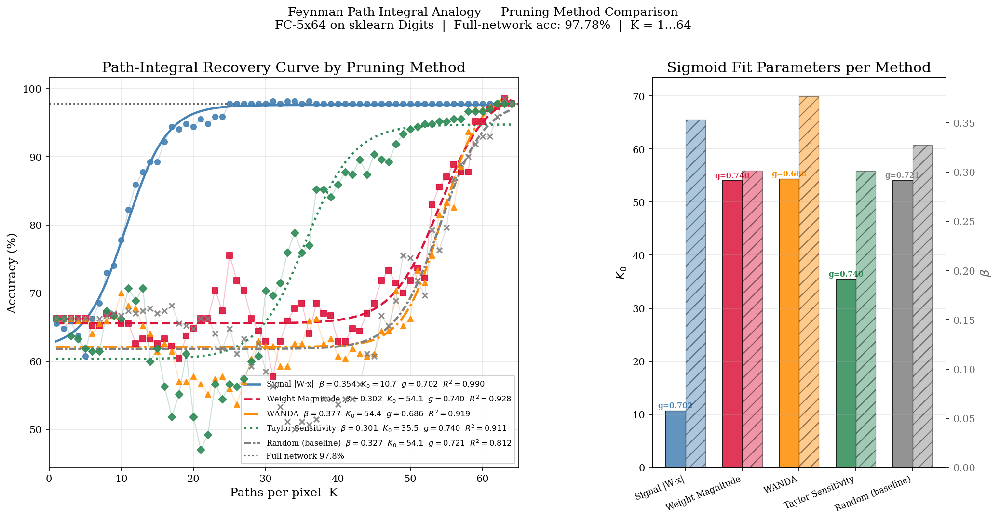
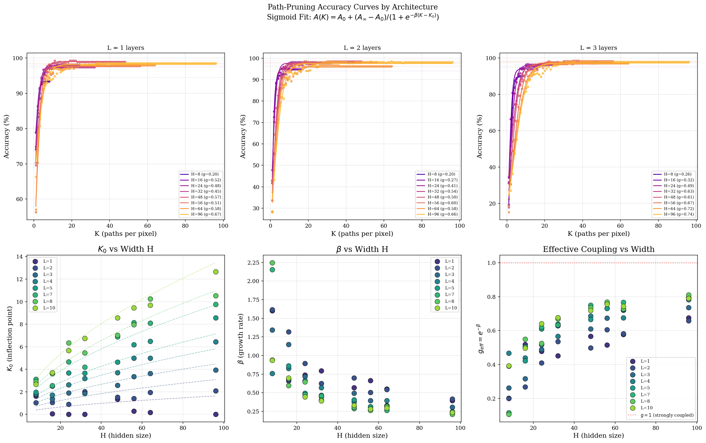
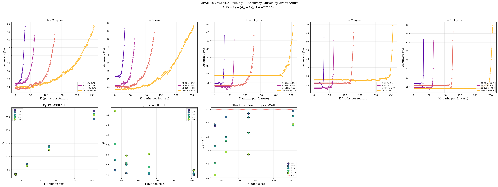
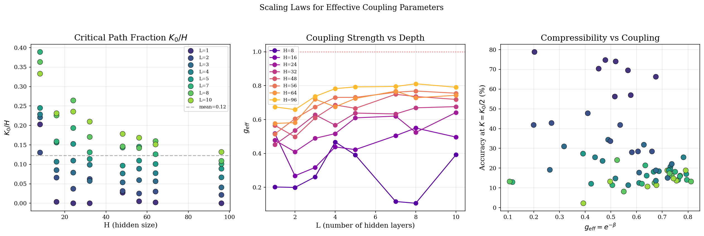
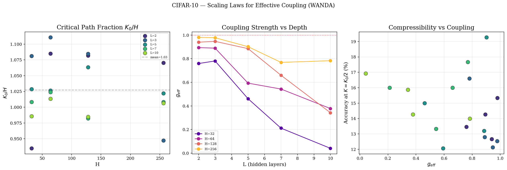
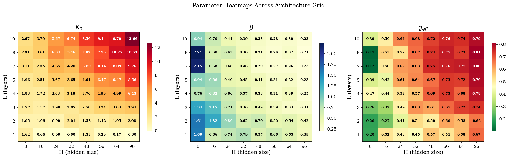
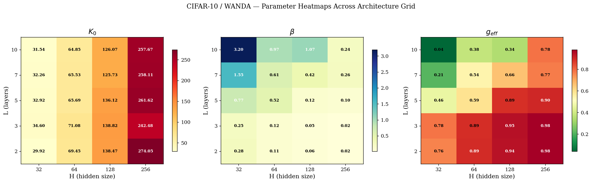

# critiPrune

**Neural Network Pruning as a Phase Transition**

> Structured pruning of neural networks -- from tiny FC networks to billion-parameter LLMs -- obeys a universal sigmoid recovery law with a sharp critical threshold, analogous to a second-order phase transition in statistical mechanics.

---

## Key Finding

When neurons are progressively restored to a pruned network, performance does not recover gradually. Instead, it undergoes a **sharp sigmoidal transition** at a critical fraction $K_0$, fit by:

$$A(K) = A_0 + \frac{A_\infty - A_0}{1 + e^{-\beta(K - K_0)}}$$

The sigmoid parameters then follow **power-law scaling** in architecture:

$$K_0 \approx a \cdot H^\alpha \cdot L^\gamma \qquad \beta \approx a' \cdot H^{\alpha'} \cdot L^{\gamma'}$$

where $H$ is hidden width and $L$ is depth. This pattern holds across FC networks, the Pythia transformer family, and mixed open-source LLMs -- suggesting a **universal** mechanism rooted in the combinatorial structure of neural paths.

| Parameter | Physical Analogy |
|-----------|-----------------|
| $K_0$ | Critical temperature -- the phase transition point |
| $\beta$ | Inverse correlation length -- steepness of the transition |
| $g_{\text{eff}} = e^{-\beta}$ | Effective coupling constant |
| $\chi(K)$ | Susceptibility -- loss variance peaks sharply at $K_0$ |

---

## Results

### Pruning Method Comparison (MNIST)

Five pruning strategies are compared on a 5-layer, 64-hidden FC network. Signal pruning ($|W \cdot x|$) recovers accuracy earliest ($K_0 \approx 11$), while weight-magnitude, WANDA, and random pruning require nearly the full network ($K_0 \approx 54$). All methods produce sigmoidal recovery curves with high $R^2_{\text{adj}}$.

<p align="center">
  
</p>

### Scaling Curves Across Architectures

Sigmoid fits across a grid of $H \in \{16, 24, 32, 48, 64, 80, 96\}$ and $L \in \{2, \ldots, 12\}$ (MNIST) and $H \in \{32, 64, 128, 256\}$ and $L \in \{2, 3, 5, 7, 10\}$ (CIFAR-10). The critical threshold $K_0$ grows with both width and depth, while steepness $\beta$ decreases -- wider and deeper networks have smoother, later transitions.

<p align="center">
  
</p>

<p align="center">
  
</p>

### Power-Law Scaling Laws

The extracted sigmoid parameters ($K_0$, $\beta$, $g_{\text{eff}}$) obey power laws in $H$ and $L$:

| Dataset | Scaling Law | $R^2_{\text{adj}}$ |
|---------|------------|:---:|
| MNIST | $K_0 = 0.111 \cdot H^{0.59} \cdot L^{0.92}$ | 0.95 |
| MNIST | $\beta = 6.80 \cdot H^{-0.68} \cdot L^{-0.12}$ | 0.72 |
| CIFAR-10 | $K_0 = 1.21 \cdot H^{0.98} \cdot L^{-0.03}$ | 0.99 |
| CIFAR-10 | $\beta = 1.98 \cdot H^{-1.14} \cdot L^{1.90}$ | 0.96 |

The near-linear scaling $K_0 \propto H^{0.98}$ on CIFAR-10 implies that the critical fraction $K_0/H$ is approximately constant -- a fixed percentage of neurons is always critical.

<p align="center">
  
</p>

<p align="center">
  
</p>

### Parameter Heatmaps

Heatmaps of $K_0$, $\beta$, and $g_{\text{eff}}$ over the $(H, L)$ architecture grid reveal smooth, monotonic trends -- consistent with a continuous (second-order) phase transition rather than a sharp first-order jump.

<p align="center">
  
</p>

<p align="center">
  
</p>

---

## Framework Validated On

| Scale | Models | Pruning | Metric |
|-------|--------|---------|--------|
| FC networks | $H \times L$ grid on MNIST / CIFAR-10 | Signal, Weight, WANDA, Taylor, Random | Accuracy |
| Pythia family | 14M, 70M, 160M, 410M, 1B, 1.4B, 2.8B, 6.9B | WANDA (MLP neurons) | Perplexity |
| Mixed LLMs | TinyLlama-1.1B, Qwen2.5-0.5B, SmolLM2-1.7B | Top-K activation sparsity | Loss / Perplexity |

---

## Repository Structure

```
pruning/
  pruning.py              Core library: FCNetwork, pruning methods, sigmoid fitting
  mnist_scaling.py         MNIST scaling law experiments (H x L grid)
  cifar_scaling.py         CIFAR-10 scaling laws (WANDA pruning)
  Pythia_test.ipynb        Pythia LLM family: WANDA pruning + scaling laws
  LLM_pruning_test.ipynb   Mixed LLMs: susceptibility + data collapse analysis
  test.py                  Unit tests
assets/                    Pre-generated figures and result JSONs
```

### `pruning.py` -- Core Library

- **`FCNetwork`** -- PyTorch FC-ReLU network with Adam optimiser, He initialisation, and per-instance seeding
- **Five pruning methods** (precomputed as column masks):
  - `signal` -- Dynamic $|W \cdot x|$ magnitude
  - `weight` -- Static weight-magnitude ranking
  - `wanda` -- WANDA ($|W| \times \|x\|$, [Sun et al. 2023](https://arxiv.org/abs/2306.11695))
  - `taylor` -- First-order Taylor sensitivity ($|\nabla_W \cdot W|$)
  - `random` -- Uniform random baseline
- **`fit_sigmoid`** -- Scipy curve-fit with adjusted $R^2$
- **`evaluate_path_accuracy`** -- Batched K-sweep with memory budget control

### `mnist_scaling.py` / `cifar_scaling.py`

Train FC networks across architecture grids and extract sigmoid parameters for each configuration. Fit joint power-law scaling $K_0 = a \cdot H^\alpha \cdot L^\gamma$. CIFAR-10 uses PCA dimensionality reduction (3072 to 200, retaining 94.5% variance) and WANDA-only pruning.

### `Pythia_test.ipynb`

Extends the framework to **transformer MLP layers** across the Pythia model family (14M to 6.9B parameters):
1. Collect MLP activation statistics over 128 C4 calibration samples
2. Compute per-neuron WANDA scores (combined up/down-projection signals)
3. Sweep $K$ = fraction of $d_{\text{ff}}$ neurons kept, measuring perplexity on WikiText-2
4. Fit sigmoid and extract $(K_0, \beta)$
5. Fit joint power-law scaling across the model family

Designed for Google Colab T4 (up to 2.8B); A100 needed for 6.9B.

### `LLM_pruning_test.ipynb`

Tests the phase transition hypothesis on mixed LLMs with two experiments:

- **Experiment 1 -- Sigmoid recovery**: Top-K activation sparsity on MLP down-projection layers
- **Experiment 2 -- Susceptibility divergence**: Measures loss variance $\chi(K)$ across 10 diverse prompts; a sharp peak at $K_0$ is the signature of a genuine second-order phase transition
- **Data collapse**: Recovery curves for different model sizes collapse onto a universal curve when plotted against $(K - K_0) \cdot d_{\text{ff}}^{1/\nu}$, confirming finite-size scaling

---

## Installation

```bash
pip install numpy scipy scikit-learn matplotlib torch

# For LLM experiments (notebooks):
pip install transformers datasets accelerate
```

GPU runtime (Google Colab T4 or better) is recommended for the notebooks.

## Quick Start

**Run MNIST scaling laws:**
```bash
cd pruning
python mnist_scaling.py
```

**Run CIFAR-10 scaling laws:**
```bash
cd pruning
python cifar_scaling.py
```

**Use as a library:**
```python
from pruning.pruning import (
    FCNetwork, precompute_pruning_scores,
    evaluate_path_accuracy, fit_sigmoid,
)

model = FCNetwork(input_size=64, hidden_size=128, num_hidden_layers=3, num_classes=10)
model.train(X_tr, y_tr, X_val, y_val, epochs=300)

scores = precompute_pruning_scores(model, X_tr, y_tr, methods=['wanda'])
k_values = list(range(1, 129))
accs, normal_acc = evaluate_path_accuracy(model, X_te, y_te, k_values, scores['wanda'])

popt, perr, r2 = fit_sigmoid(k_values, accs, normal_acc)
K_0, beta = popt[2], popt[3]
```

**LLM experiments:** Open `pruning/Pythia_test.ipynb` or `pruning/LLM_pruning_test.ipynb` in Colab with a GPU runtime.

---

## References

- [Information Flow Through Neural Networks](https://arxiv.org/pdf/1712.00003) (2017)
- [The Lottery Ticket Hypothesis](https://arxiv.org/abs/1803.03635) (Frankle & Carlin, 2018)
- [WANDA: Pruning by Weights and Activations](https://arxiv.org/abs/2306.11695) (Sun et al., 2023)
- [Phase Transitions in LLMs and O(N)](https://arxiv.org/pdf/2501.16241) (2025)
- [Phase Transitions in Neural Network Pruning](https://arxiv.org/pdf/2602.15224) (2026)
- [Phase Transitions in LLMs](https://www.nature.com/articles/s44387-026-00072-8) (Nature, 2026)

## License

[MIT](LICENSE) -- Chris Chalkias, 2026
