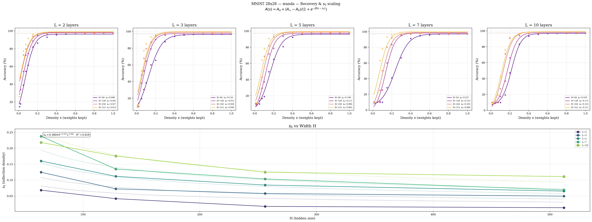
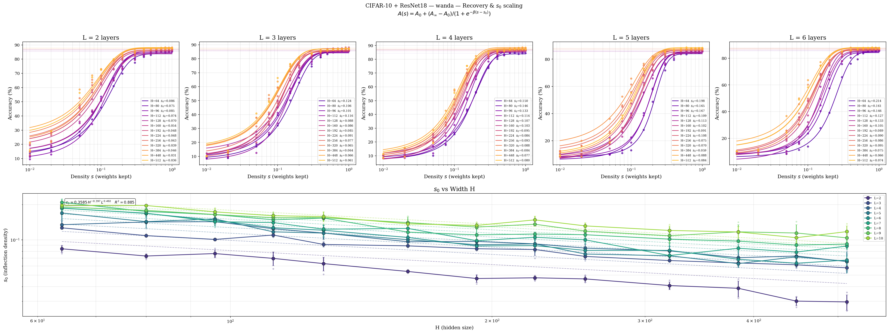
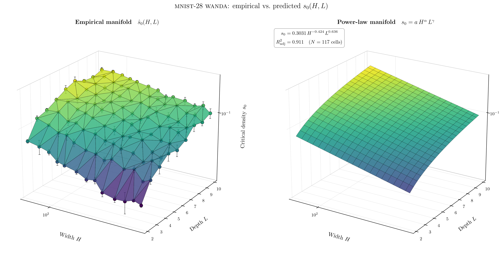
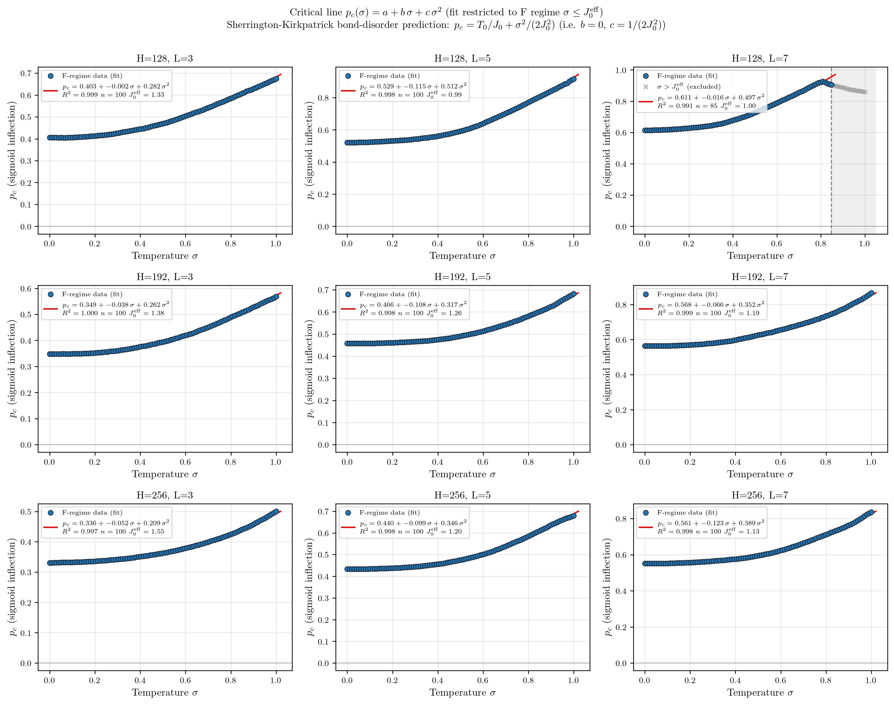
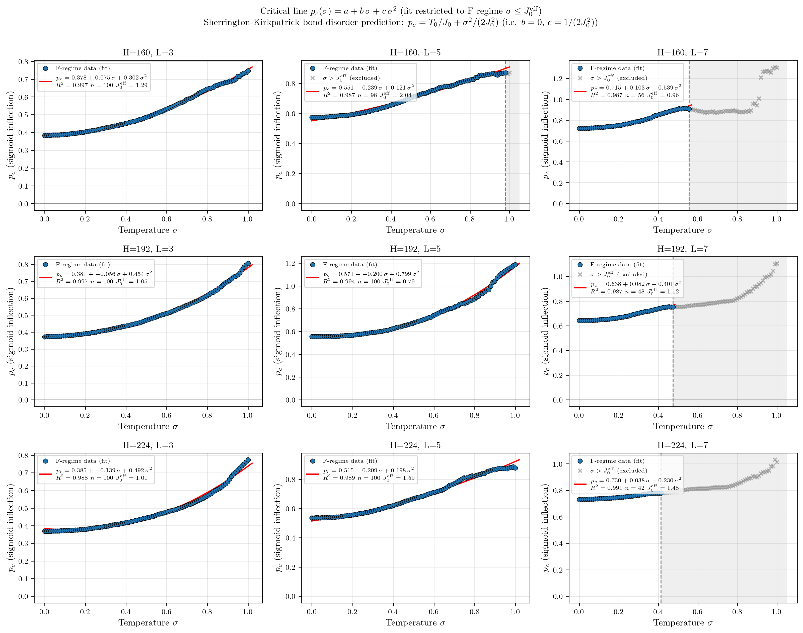
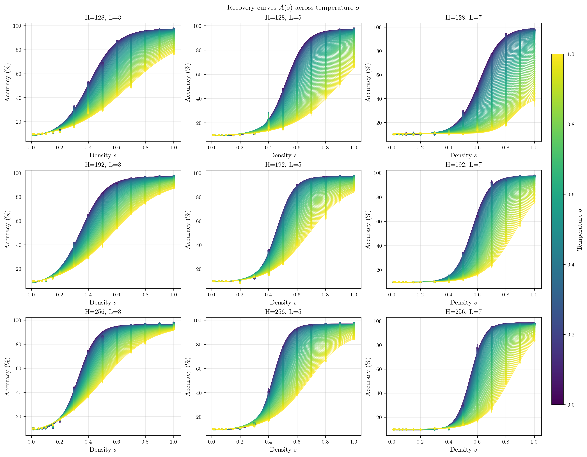

# critiPrune

**Neural Network Pruning as a Phase Transition**

> Pruning a trained neural network reveals a sharp, second-order phase transition. Test accuracy as a function of surviving-weight density $s$ collapses onto a universal sigmoid with a critical inflection $s_0$, and $s_0$ obeys clean power-law scaling in width $H$ and depth $L$. Sweeping a controlled inference-time disorder amplitude $\sigma$ in addition to $s$ traces the critical line and singles out the **Sherrington–Kirkpatrick bond-disorder** mean-field universality class as the right physical model.

---

## Key Finding

When weights are progressively restored to a pruned network, accuracy does not recover gradually. Instead it undergoes a sharp sigmoidal transition at a critical density $s_0$:

$$A(s) = A_0 + \frac{A_\infty - A_0}{1 + e^{-\beta(s - s_0)}}$$

The inflection $s_0$ follows a power law in architecture,

$$s_0(H, L) \;=\; c \cdot H^{\alpha} \cdot L^{\gamma},$$

and, when an additive Gaussian weight perturbation of amplitude $\sigma$ is applied at inference time, the empirical critical line is **parabolic** in $\sigma$ inside the ferromagnetic regime $\sigma \le J_0$,

$$p_c(\sigma) \;=\; \underbrace{\frac{T_0}{J_0}}_{a} \;+\; \underbrace{0}_{b}\,\sigma \;+\; \underbrace{\frac{1}{2 J_0^2}}_{c}\,\sigma^2,$$

with vanishing linear coefficient. This is the Sherrington–Kirkpatrick bond-disorder prediction, *not* the strict Curie–Weiss form $p_c \propto \sigma$: the noise knob acts as the disorder amplitude $J_1$, not as a Boltzmann temperature. Beyond $\sigma \approx J_0$ the parabola breaks down — empirically this F→SG / thermalisation transition is observed in 9 of 27 architecture cells, all at the largest depths.

| Parameter | Physical analogy |
|-----------|------------------|
| $s_0$ | Critical pruning threshold (phase transition point) |
| $\beta$ | Inverse correlation length (steepness of the transition) |
| $a$ in $p_c(\sigma) = a + c\sigma^2$ | Operating temperature ratio $T_0/J_0$ |
| $c$ | $1/(2J_0^2)$ — direct estimator of the effective coupling |

---

## Main Results

### 1. Sigmoid recovery & power-law scaling (`unstructured_pruning/`)

We sweep a dense $H \times L$ architecture grid on four datasets, prune trained checkpoints with three protocols (random Bernoulli, weight-magnitude, WANDA) at 15 density levels, and fit the four-parameter sigmoid per cell.

| Dataset | Input dim | $H$ grid | $L$ grid |
|---|---|---|---|
| sklearn-digits | 64 | $\{8, 10, 12, \ldots, 96\}$ (23 values) | $\{1, 2, \ldots, 10\}$ |
| MNIST 28×28 | 784 | $\{64, 80, \ldots, 512\}$ (13 values) | $\{2, 3, \ldots, 10\}$ |
| CIFAR-PCA(200) | 200 | same | same |
| CIFAR-ResNet18 | 512 | same | same |

The sigmoid fit succeeds with adjusted $R^2 > 0.9$ in the overwhelming majority of cells. The inflection $s_0$ obeys $s_0 \propto H^\alpha L^\gamma$ with consistent signs across all four datasets:

| Dataset | WANDA scaling law | $R^2_\text{adj}$ |
|---|---|:---:|
| sklearn-digits      | $s_0 = 0.247 \cdot H^{-0.34} \cdot L^{0.77}$ | 0.90 |
| MNIST 28×28         | $s_0 = 0.360 \cdot H^{-0.43} \cdot L^{0.64}$ | 0.92 |
| CIFAR-PCA(200)      | $s_0 = 0.302 \cdot H^{-0.31} \cdot L^{0.61}$ | 0.87 |
| CIFAR-ResNet18      | $s_0 = 0.257 \cdot H^{-0.41} \cdot L^{0.49}$ | 0.94 |

The width exponent $\alpha \in [-0.43, -0.31]$ is consistently negative — wider networks are more compressible — and the depth exponent $\gamma \in [0.49, 0.77]$ is consistently positive. These signs match the layered mean-field prediction $p_c \sim L/H$ from the toy model.

<p align="center">
  
  <br/>
  <em>Recovery curves $A(s)$ for MNIST-28 with WANDA pruning across the $(H, L)$ grid.</em>
</p>

<p align="center">
  
  <br/>
  <em>Same on CIFAR-10 with frozen ResNet18 features.</em>
</p>

<p align="center">
  
  <br/>
  <em>$s_0(H, L)$ as a fitted manifold over the $H \times L$ grid (MNIST-28, WANDA).</em>
</p>

### 2. Critical line under inference-time bond disorder (`temperature_pruning/`)

The diluted Curie–Weiss toy model predicts $p_c(T) = T / J_0$, a strictly linear critical line through the origin. To test this we sweep an additive Gaussian weight perturbation

$$W_{ij}^{(\ell)} \;\to\; W_{ij}^{(\ell)} + \varepsilon_{ij}^{(\ell)}, \qquad \varepsilon \sim \mathcal{N}\!\bigl(0,\, \sigma^2\,\mathrm{rms}(W^{(\ell)})^2\bigr),$$

on $100$ values of $\sigma \in [0, 1]$ jointly with the random-pruning density grid, on already-trained checkpoints from `unstructured_pruning/`. The empirical critical lines across all three benchmark datasets are well-described, **inside the F regime**, by a quadratic with vanishing linear term:

$$p_c(\sigma) = a + b\,\sigma + c\,\sigma^2, \qquad b \approx 0, \quad c > 0.$$

This is the **Sherrington–Kirkpatrick bond-disorder** prediction $p_c(\sigma) = T_0/J_0 + \sigma^2/(2 J_0^2)$, with the noise knob identified as the SK disorder amplitude $J_1$ rather than a Boltzmann temperature.

**F-regime restriction.** The SK derivation is valid only in the ferromagnetic regime $J_0 > J_1$; beyond the F→SG line the order parameter switches from magnetisation $m$ to the Edwards–Anderson $q$ and the parabolic ansatz breaks down. We restrict the fit to the F regime by a data-driven rule: bootstrap the parabola on $\sigma \le 0.3$, walk outward, and stop when the running $R^2$ drops more than $0.01$ below the bootstrap value. **9 of 27 cells** trigger the cutoff inside $\sigma \in [0, 1]$ — all of them at the largest depths $L \in \{5, 7\}$, consistent with deeper networks accumulating disorder faster and crossing the SK F→SG line at smaller $\sigma$. In every triggering cell the empirical breakdown $\sigma_\text{cutoff}$ tracks $J_0^\text{eff} = 1/\sqrt{2c}$ to within $\pm 0.1$, a non-trivial second confirmation of the SK picture.

<p align="center">
  
  <br/>
  <em>Empirical critical line $p_c(\sigma)$ on MNIST-28×28 across nine $(H, L)$ cells. Blue: F-regime data used in the fit. Grey crosses + shaded region: SG/thermalisation regime excluded from the fit. Red: quadratic fit. Only $H=128, L=7$ (top-right) shows a clear F→SG breakdown within $\sigma \in [0, 1]$, at $\sigma_\text{cutoff} = 0.85$.</em>
</p>

<p align="center">
  
  <br/>
  <em>Same on CIFAR-10 with frozen ResNet18 features. Four of nine cells show an SG/thermalisation regime within the swept range — every $L=7$ cell plus $H=160, L=5$.</em>
</p>

The fit returns direct estimates of the effective coupling $J_0^\text{eff} = 1/\sqrt{2c}$ and the operating temperature $T_0 = a \cdot J_0^\text{eff}$. Representative values:

| Cell | $a$ | $c$ | $J_0^\text{eff}$ | $T_0$ | $\sigma_\text{cutoff}$ |
|---|:---:|:---:|:---:|:---:|:---:|
| sklearn-digits $H{=}64$, $L{=}3$ | 0.503 | 0.422 | 1.09 | 0.55 | — |
| MNIST $H{=}192$, $L{=}5$         | 0.466 | 0.317 | 1.26 | 0.59 | — |
| CIFAR-ResNet $H{=}192$, $L{=}3$  | 0.381 | 0.454 | 1.05 | 0.40 | — |
| sklearn-digits $H{=}32$, $L{=}5$ | 0.756 | 0.863 | 0.76 | 0.58 | 0.65 |
| MNIST $H{=}128$, $L{=}7$         | 0.611 | 0.497 | 1.00 | 0.61 | 0.85 |
| CIFAR-ResNet $H{=}192$, $L{=}7$  | 0.638 | 0.401 | 1.12 | 0.71 | 0.47 |

Across the full 27-cell grid the medians are $\langle J_0^\text{eff}\rangle \approx 1.13$ and $\langle T_0 \rangle \approx 0.57$, with $T_0$ falling in $[0.40, 0.85]$ — a roughly universal effective inference temperature for random-pruned MLPs despite order-of-magnitude differences in input dimension. The non-zero intercept $a > 0$ packages three contributions into a single empirical thermometer:

1. The **random-pruning structural floor** (dropping high-magnitude weights at random has a cost even at $\sigma = 0$).
2. The **heterogeneous-trained-weights** mismatch with the uniform-coupling toy model.
3. The **finite-$D$ + finite-$L$** corrections from sample-complexity ($T_\text{ERM} = T_\star/D$) and saddle rounding ($\delta T_c \sim L^{-1/2}$).

<p align="center">
  
  <br/>
  <em>Recovery curves $A(s; \sigma)$ for MNIST-28 across the full 100-point $\sigma$ grid; colour encodes $\sigma$.</em>
</p>

For the theory background of the SK-with-bond-disorder model and what the parabolic critical line tells us, see [`docs/sherrington_kirkpatrick.md`](docs/sherrington_kirkpatrick.md).

---

## Framework Validated On

| Scale | Models | Pruning | Metric | Module |
|---|---|---|---|---|
| FC unstructured | $H \times L$ grid on 4 datasets | random / magnitude / WANDA | accuracy | `unstructured_pruning/` |
| FC + inference-time disorder | $H \times L$ grid on 3 datasets | random + Gaussian weight noise | accuracy | `temperature_pruning/` |
| FC structured (legacy) | $H \times L$ on sklearn / CIFAR | signal / weight / WANDA / Taylor / random | accuracy | `pruning/` |
| Pythia transformer family | 14M–6.9B | WANDA on MLP neurons | perplexity | `pruning/Pythia_test.ipynb` |
| Mixed open-source LLMs | TinyLlama-1.1B, Qwen2.5-0.5B, SmolLM2-1.7B | top-K activation sparsity | loss / perplexity | `pruning/LLM_pruning_test.ipynb` |

---

## Repository Structure

```
unstructured_pruning/        Main results: weight-level pruning across 4 datasets
  core.py                      shared (H, L) grid runner — train, mask, fit, plot
  methods.py                   random_masks, magnitude_masks, wanda_masks
  {sklearn,mnist28,cifar,cifar_resnet}_scaling.py
                               thin per-dataset wrappers over core
  loss_scaling.py              cross-entropy-based scaling diagnostics
  param_scaling.py             critical density vs total parameter count
  plot_3d_scaling.py           3D manifold renderer for s_0(H, L)
  figures/                     per-dataset PNGs + JSON results
  checkpoints/                 trained model checkpoints (one per (H, L, repeat))

temperature_pruning/         Empirical test of the SK-with-bond-disorder critical line
  noise.py                     Gaussian weight-noise temperature knob (per-layer RMS-scaled)
  core.py                      (sigma, density) sweep runner with resumable JSON output
  analysis.py                  per-cell quadratic fit + data-collapse diagnostic
  plots.py                     accuracy curves, critical line, data collapse
  main.py                      argparse driver with per-dataset registry
  figures/                     critical_line / accuracy_curves / data_collapse per dataset

pruning/                     Legacy structured pruning + LLM notebooks
  pruning.py                   FCNetwork class, sigmoid_fit, path-tracing engine
  {mnist,mnist28,cifar,pythia}_scaling.py
  Pythia_test.ipynb            transformer scaling laws across the Pythia family
  LLM_pruning_test.ipynb       mixed-LLM susceptibility + data collapse
  test.py                      unit tests

docs/paper/                  IsingPruning.tex + IsingPruning.pdf (theory writeup)
u_scripts/                   SLURM batch scripts for ALICE HPC
assets/                      Cross-cutting reference figures used in the paper
```

---

## Quick Start

**Unstructured pruning sweep (main results):**
```bash
python -m unstructured_pruning.mnist28_scaling --method wanda
python -m unstructured_pruning.cifar_resnet_scaling --method wanda
# outputs to unstructured_pruning/figures/unstructured_figures_<dataset>_<method>/
```

**Temperature/bond-disorder critical-line sweep (uses the trained checkpoints from above):**
```bash
python -m temperature_pruning.main --dataset sklearn       # ~70 s
python -m temperature_pruning.main --dataset mnist28       # ~6 min
python -m temperature_pruning.main --dataset cifar_resnet  # ~4 min after feature extraction
# outputs to temperature_pruning/figures/<dataset>/
```

**Re-render plots only from existing JSON:**
```bash
python -m temperature_pruning.main --dataset mnist28 --analysis-only
```

**Submit the full unstructured grid to ALICE HPC (4 datasets × 3 methods):**
```bash
bash u_scripts/submit.sh
DATASETS="sklearn mnist28" METHODS="magnitude wanda" bash u_scripts/submit.sh
```

**Use as a library:**
```python
from unstructured_pruning.core import (
    load_fc_checkpoint, evaluate_masked_accuracy, DEFAULT_DENSITIES,
)
from unstructured_pruning.methods import random_masks
from temperature_pruning.noise import add_weight_noise
import numpy as np

model, _ = load_fc_checkpoint(
    'unstructured_pruning/checkpoints/unstructured_figures_mnist28_random/H192_L5_r2.pt'
)
rng = np.random.default_rng(0)
noisy = add_weight_noise(model, sigma=0.2, rng=rng)
masks = random_masks(noisy, DEFAULT_DENSITIES, n_seeds=3)
accs, baseline = evaluate_masked_accuracy(noisy, X_test, y_test, masks)
```

---

## Installation

```bash
pip install numpy scipy scikit-learn matplotlib torch torchvision

# Optional: LLM experiments in pruning/
pip install transformers datasets accelerate
```

The FC and temperature_pruning experiments run fine on CPU. GPU recommended only for the LLM notebooks.

---

## References

- [Information Flow Through Neural Networks](https://arxiv.org/pdf/1712.00003) (2017)
- [The Lottery Ticket Hypothesis](https://arxiv.org/abs/1803.03635) (Frankle & Carbin, 2018)
- [WANDA: Pruning by Weights and Activations](https://arxiv.org/abs/2306.11695) (Sun et al., 2023)
- [Phase diagrams for dilute spin glasses](https://doi.org/10.1088/0022-3719/18/15/013) (Viana & Bray, 1985)
- [Phase Transitions in Neural Network Pruning](https://arxiv.org/pdf/2602.15224) (2026)
- [Phase Transitions in LLMs](https://www.nature.com/articles/s44387-026-00072-8) (Nature, 2026)

## License

[MIT](LICENSE) — Chris Chalkias, 2026
