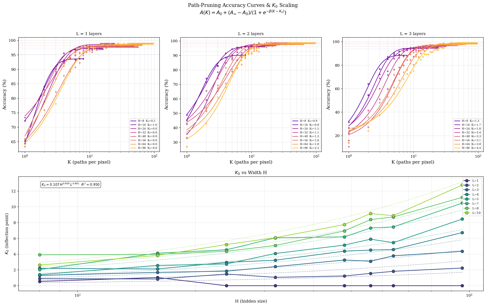
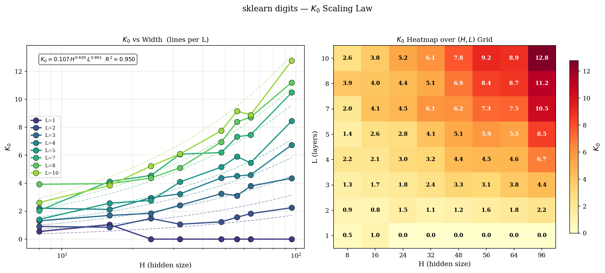
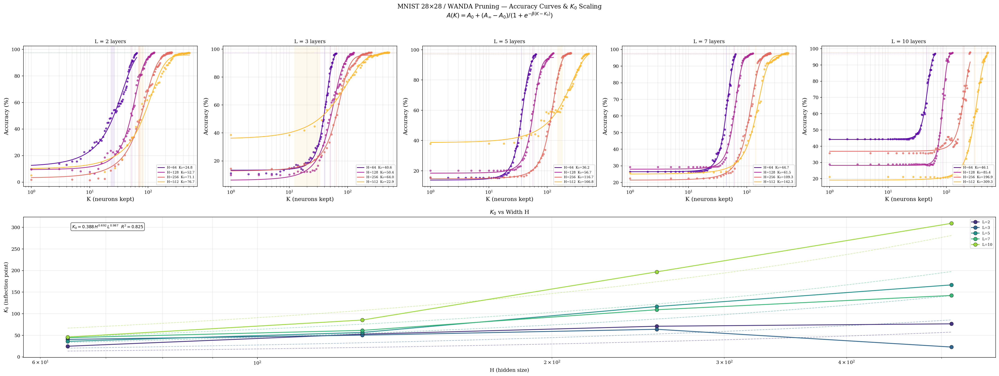
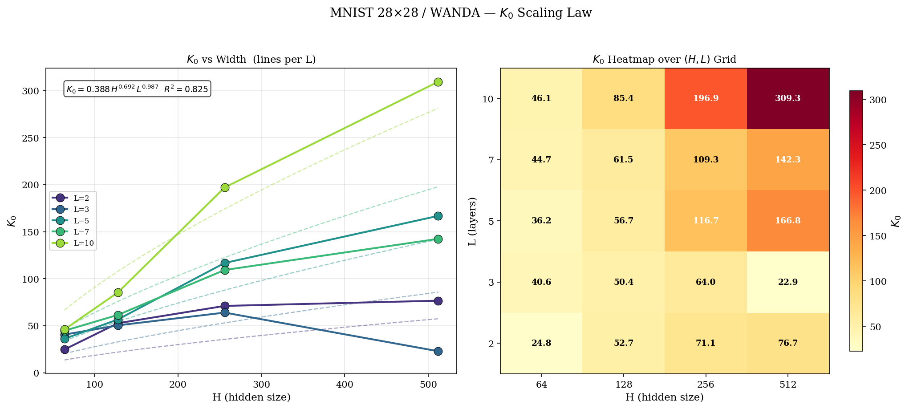

# critiPrune

**Neural Network Pruning as a Phase Transition**

> Pruning neural networks reveals a universal sigmoid recovery law with a sharp critical threshold, analogous to a second-order phase transition in statistical mechanics. This holds whether you prune whole neurons (structured) or individual weights (unstructured), and whether the network is a tiny FC classifier or a billion-parameter LLM.

---

## Key Finding

When neurons are progressively restored to a pruned network, accuracy does not recover gradually. Instead it undergoes a sharp sigmoidal transition at a critical fraction $K_0$:

$$A(K) = A_0 + \frac{A_\infty - A_0}{1 + e^{-\beta(K - K_0)}}$$

The sigmoid parameters follow power-law scaling in architecture:

$$K_0 \approx c \cdot H^\alpha \cdot L^\gamma \qquad \beta \approx c' \cdot H^{\alpha'} \cdot L^{\gamma'}$$

where $H$ is hidden width and $L$ is depth. For unstructured (weight-level) pruning the same sigmoid applies, but the x-axis is weight density $s \in (0,1]$ instead of neuron count $K$:

$$A(s) = A_0 + \frac{A_\infty - A_0}{1 + e^{-\beta(s - s_0)}}$$

The pattern holds across FC networks, the Pythia transformer family, and mixed open-source LLMs, which points to a universal mechanism tied to the combinatorial structure of neural paths.

| Parameter | Physical Analogy |
|-----------|-----------------|
| $K_0$ | Critical pruning threshold, the phase transition point |
| $\beta$ | Inverse correlation length, steepness of the transition |
| $g_{\text{eff}} = e^{-\beta}$ | Effective coupling constant |

---

## Results

### Pruning Method Comparison (sklearn digits)

Five structured pruning strategies on a 5-layer, 64-hidden FC network. Signal pruning ($|W \cdot x|$) recovers accuracy earliest ($K_0 \approx 11$), while weight-magnitude, WANDA, and random pruning need nearly the full network ($K_0 \approx 54$). All methods produce sigmoidal recovery curves with high adjusted $R^2$.

<p align="center">
  
</p>

### Structured Pruning: Scaling Curves

Sigmoid fits over a grid of $H \in \{8, 16, 24, 32, 48, 56, 64, 96\}$ and $L \in \{1, 2, 3, 4, 5, 7, 8, 10\}$ on sklearn digits, and $H \in \{32, 64, 128, 256\}$ and $L \in \{2, 3, 5, 7, 10\}$ on CIFAR-10. The critical threshold $K_0$ grows with both width and depth, while $\beta$ decreases, so wider and deeper networks have smoother, later transitions.

<p align="center">
  
</p>

<p align="center">
  
</p>

### Structured Pruning: Power-Law Scaling Laws

Extracted sigmoid parameters ($K_0$, $\beta$, $g_{\text{eff}}$) as power laws in $H$ and $L$:

| Dataset | Scaling Law | $R^2_{\text{adj}}$ |
|---------|------------|:---:|
| sklearn digits | $K_0 = 0.089 \cdot H^{0.65} \cdot L^{0.90}$ | 0.95 |
| sklearn digits | $g = 0.127 \cdot H^{0.37} \cdot L^{0.13}$ | 0.84 |
| CIFAR-10 | $K_0 = 1.21 \cdot H^{0.98} \cdot L^{-0.03}$ | 0.99 |
| CIFAR-10 | $\beta = 1.98 \cdot H^{-1.14} \cdot L^{1.90}$ | 0.96 |

The near-linear scaling $K_0 \propto H^{0.98}$ on CIFAR-10 means the critical fraction $K_0/H$ is roughly constant around 1.03, so you always need almost all neurons to recover accuracy on a harder task. On sklearn digits the sub-linear exponent (0.65) shows that wider networks become relatively more compressible.

<p align="center">
  
</p>

<p align="center">
  
</p>

### Unstructured Pruning

We extended the framework to weight-level (unstructured) pruning with three methods:

- **Random** - Bernoulli masks with keep-probability $s$, averaged over 3 seeds
- **Magnitude** - keep top-$s$ fraction of weights by $|W_{ij}|$ per layer
- **WANDA** - per-row score $|W_{ij}| \cdot \|X_j\|_2$, following [Sun et al. 2023](https://arxiv.org/abs/2306.11695)

Experiments run on four datasets to cover a range of input dimensions:

| Dataset | Input dim | Architecture grid |
|---------|-----------|-------------------|
| sklearn digits | 64 | $H \in \{8,16,24,32,48,56,64,96\}$, $L \in \{1,2,3,4,5,7,8,10\}$ |
| MNIST 28x28 | 784 | $H \in \{64,128,256,512\}$, $L \in \{2,3,5,7,10\}$ |
| CIFAR-10 + PCA(200) | 200 | $H \in \{64,128,256,512\}$, $L \in \{2,3,5,7,10\}$ |
| CIFAR-10 + ResNet18 | 512 | $H \in \{64,128,256,512\}$, $L \in \{2,3,5,7,10\}$ |

The same sigmoid transition appears in accuracy vs weight density $s$, and $s_0$ follows power laws in architecture:

| Dataset | Scaling Law | $R^2_{\text{adj}}$ |
|---------|------------|:---:|
| sklearn digits | $s_0 = 0.089 \cdot H^{0.65} \cdot L^{0.90}$ | 0.95 |
| MNIST 28x28 | $s_0 = 0.388 \cdot H^{0.69} \cdot L^{0.99}$ | 0.82 |
| CIFAR-10 + PCA | $s_0 = 0.236 \cdot H^{0.91} \cdot L^{0.83}$ | 0.78 |

Notably, the depth exponent ($\gamma \approx 0.9$-$1.0$) is consistent across datasets, suggesting that each additional layer contributes roughly proportionally to the network's weight-level redundancy.

<p align="center">
  
</p>

<p align="center">
  
</p>

---

## Framework Validated On

| Scale | Models | Pruning | Metric |
|-------|--------|---------|--------|
| FC (structured) | $H \times L$ grid on sklearn digits / CIFAR-10 | Signal, Weight, WANDA, Taylor, Random | Accuracy |
| FC (unstructured) | $H \times L$ grid on 4 datasets | Random, Magnitude, WANDA | Accuracy |
| Pythia family | 14M, 70M, 160M, 410M, 1B, 1.4B, 2.8B, 6.9B | WANDA (MLP neurons) | Perplexity |
| Mixed LLMs | TinyLlama-1.1B, Qwen2.5-0.5B, SmolLM2-1.7B | Top-K activation sparsity | Loss / Perplexity |

---

## Repository Structure

```
pruning/
  pruning.py              Core library: FCNetwork, pruning methods, sigmoid fitting
  mnist_scaling.py        sklearn digits scaling scan (H x L grid, saves checkpoints)
  cifar_scaling.py        CIFAR-10 structured scaling laws (WANDA pruning)
  mnist28_scaling.py      MNIST 28x28 scaling scan
  Pythia_test.ipynb       Pythia LLM family: WANDA pruning + scaling laws
  LLM_pruning_test.ipynb  Mixed LLMs: susceptibility + data collapse
  test.py                 Unit tests

unstructured_pruning/
  core.py                 Shared runner: train, mask, fit sigmoid, fit scaling law, plot
  methods.py              random_masks, magnitude_masks, wanda_masks
  mnist_scaling.py        sklearn digits (thin wrapper over core)
  mnist28_scaling.py      MNIST 28x28
  cifar_scaling.py        CIFAR-10 + PCA(200)
  cifar_resnet_scaling.py CIFAR-10 + frozen ResNet18 features (512-d)

u_scripts/
  unstructured.sbatch     SLURM batch script parameterized by DATASET and METHOD
  submit.sh               Submits all 12 jobs (4 datasets x 3 methods) to ALICE HPC

assets/                   Committed reference figures and result JSONs
```

### Core Library (`pruning/pruning.py`)

- **`FCNetwork`** - PyTorch FC-ReLU network, float64 throughout, Adam optimizer, He init, per-instance seeding
- **Five structured pruning methods** (precomputed as column/neuron masks):
  - `signal` - Dynamic $|W \cdot x|$ magnitude (input-dependent)
  - `weight` - Static weight-magnitude ranking
  - `wanda` - WANDA ($|W| \times \|x\|$, [Sun et al. 2023](https://arxiv.org/abs/2306.11695))
  - `taylor` - First-order Taylor sensitivity ($|\nabla_W \cdot W|$)
  - `random` - Uniform random baseline
- **`fit_sigmoid`** - Scipy curve-fit with adjusted $R^2$ (n-p denominator)
- **`evaluate_path_accuracy`** - Batched K-sweep path-tracing engine

### Unstructured Pruning (`unstructured_pruning/`)

`core.py` contains the shared experiment runner (`run_scaling_experiment`) used by all four dataset scripts. It trains the architecture grid, computes weight-level masks at a range of densities, fits the sigmoid recovery curve per configuration, fits joint power-law scaling, and saves figures and JSONs.

`methods.py` implements the three mask strategies. Random masks are averaged over 3 seeds since they are stochastic. Magnitude and WANDA masks are deterministic so they use a single seed.

### Scaling Scripts

`pruning/mnist_scaling.py` now saves all trained model checkpoints to `mnist_figures/checkpoints.pt` as a dict keyed by `(H, L)`, with embedded architecture metadata, so checkpoints can be shared and loaded without re-running the scan:

```python
ckpts = torch.load('mnist_figures/checkpoints.pt')
arch  = ckpts[(32, 3)]['arch']   # {'input_size':64, 'hidden_size':32, 'num_hidden_layers':3, ...}
model = FCNetwork(**arch)
model.load_state_dict(ckpts[(32, 3)]['state_dict'])
```

### Pythia Notebooks

`Pythia_test.ipynb` extends the framework to transformer MLP layers across the Pythia model family (14M to 6.9B parameters):

1. Collect MLP activation statistics over 128 C4 calibration samples
2. Compute per-neuron WANDA scores using up/down-projection signals
3. Sweep $K$ (fraction of $d_{\text{ff}}$ neurons kept) and measure perplexity on WikiText-2
4. Fit sigmoid and extract $(K_0, \beta)$
5. Fit joint power-law scaling across the model family

Designed for Google Colab T4 (up to 2.8B); A100 needed for 6.9B.

`LLM_pruning_test.ipynb` tests the phase transition on mixed open-source LLMs with two experiments:

- **Sigmoid recovery**: top-K activation sparsity on MLP down-projection layers
- **Susceptibility divergence**: loss variance $\chi(K)$ across 10 diverse prompts; a sharp peak at $K_0$ is the signature of a genuine second-order phase transition
- **Data collapse**: recovery curves for different model sizes collapse onto a universal curve when plotted against $(K - K_0) \cdot d_{\text{ff}}^{1/\nu}$

---

## Installation

```bash
pip install numpy scipy scikit-learn matplotlib torch torchvision

# For LLM experiments (notebooks):
pip install transformers datasets accelerate
```

GPU runtime (Google Colab T4 or better) is recommended for the notebooks. The FC network experiments run fine on CPU.

## Quick Start

**Run sklearn digits scaling laws:**
```bash
python pruning/mnist_scaling.py    # outputs to mnist_figures/
```

**Run unstructured pruning on MNIST 28x28:**
```bash
python -m unstructured_pruning.mnist28_scaling --method random
python -m unstructured_pruning.mnist28_scaling --method magnitude
python -m unstructured_pruning.mnist28_scaling --method wanda
```

**Submit all 12 unstructured experiments to ALICE HPC:**
```bash
bash u_scripts/submit.sh
# or a subset:
DATASETS="sklearn mnist28" METHODS="magnitude wanda" bash u_scripts/submit.sh
```

**Use as a library:**
```python
from pruning.pruning import FCNetwork, precompute_pruning_scores, evaluate_path_accuracy, fit_sigmoid

model = FCNetwork(input_size=64, hidden_size=128, num_hidden_layers=3, num_classes=10)
model.train_model(X_tr, y_tr, X_val, y_val, epochs=300)

scores = precompute_pruning_scores(model, X_tr, y_tr, methods=['wanda'])
k_values = list(range(1, 129))
accs, normal_acc = evaluate_path_accuracy(model, X_te, y_te, k_values, scores['wanda'], 'wanda')

popt, perr, r2 = fit_sigmoid(k_values, accs, normal_acc)
K_0, beta = popt[2], popt[3]
```

**LLM experiments:** Open `pruning/Pythia_test.ipynb` or `pruning/LLM_pruning_test.ipynb` in Colab with a GPU runtime.

---

## References

- [Information Flow Through Neural Networks](https://arxiv.org/pdf/1712.00003) (2017)
- [The Lottery Ticket Hypothesis](https://arxiv.org/abs/1803.03635) (Frankle & Carlin, 2018)
- [WANDA: Pruning by Weights and Activations](https://arxiv.org/abs/2306.11695) (Sun et al., 2023)
- [Phase Transitions in LLMs and O(N)](https://arxiv.org/pdf/2501.16241) (2025)
- [Phase Transitions in Neural Network Pruning](https://arxiv.org/pdf/2602.15224) (2026)
- [Phase Transitions in LLMs](https://www.nature.com/articles/s44387-026-00072-8) (Nature, 2026)

## License

[MIT](LICENSE) - Chris Chalkias, 2026
