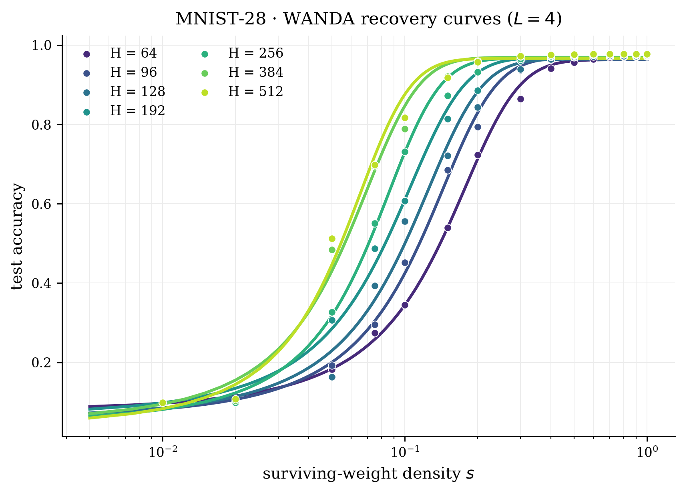
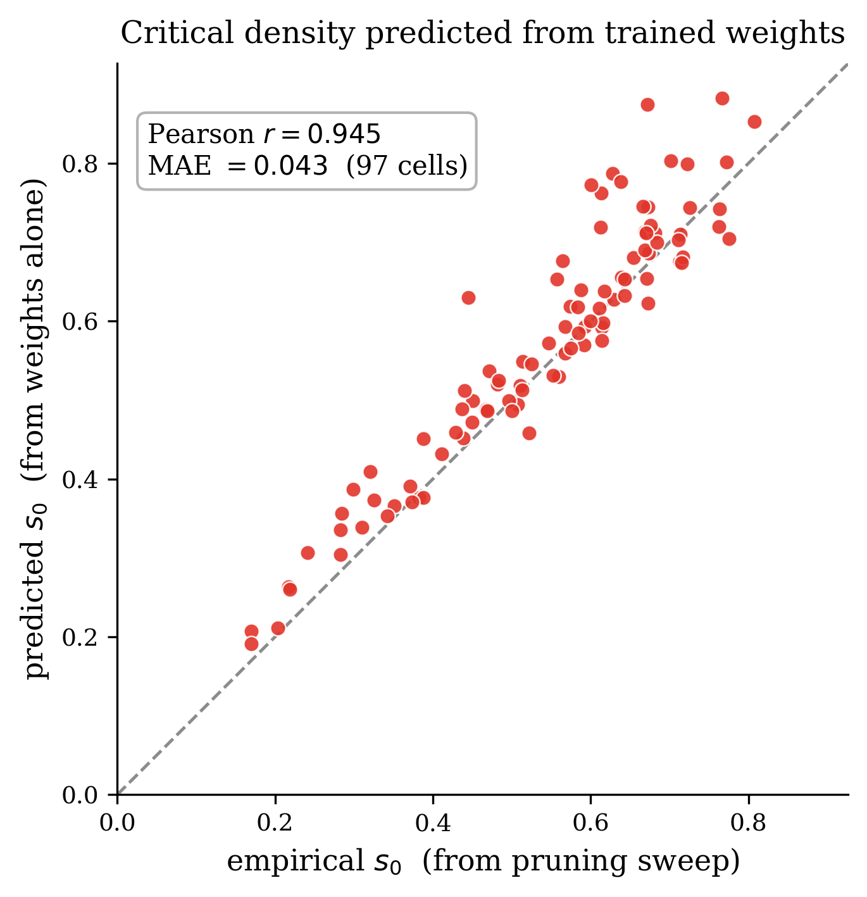
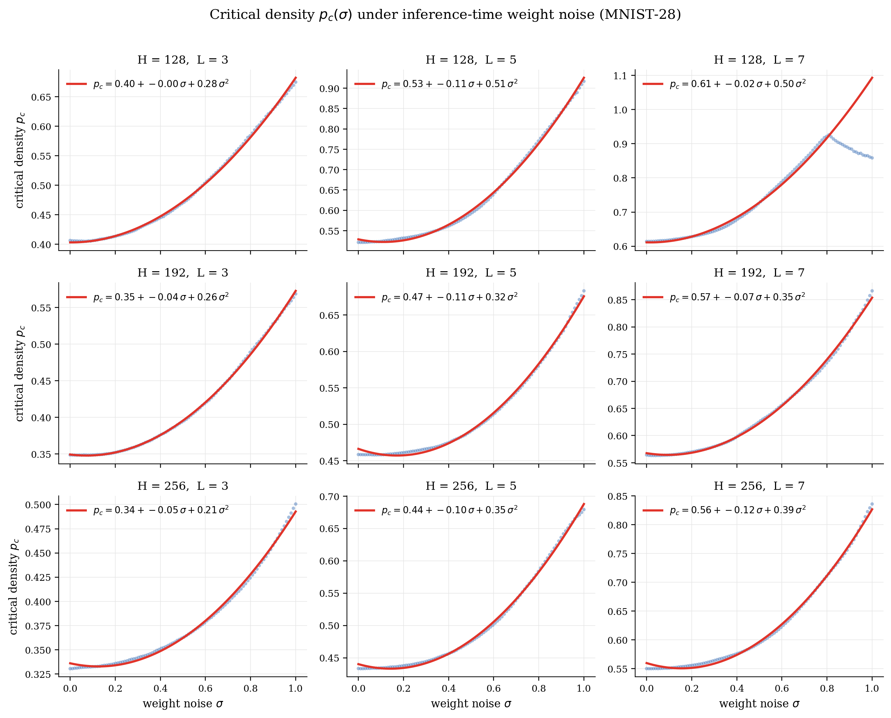

<p align="center">
  
</p>

<h1 align="center">critiPrune</h1>

<p align="center"><strong>Neural Network Pruning as a Sharp Transition</strong></p>

> Pruning a trained neural network does not degrade accuracy smoothly. As the surviving-weight density $s$ increases, test accuracy jumps from chance to its unpruned value in a sharp sigmoidal transition at a critical density $s_0$, and $s_0$ obeys a clean power law in width $H$ and depth $L$. The same critical density can be predicted directly from the trained weights — with no pruning sweep — and it rises predictably under inference-time weight noise.

---

## Key Finding

When weights are progressively restored to a pruned network, accuracy does not recover gradually. Instead it rises through a sharp sigmoidal transition at a critical density $s_0$:

$$A(s) = A_0 + \frac{A_1 - A_0}{1 + e^{-\beta(s - s_0)}}$$

where $A_0$ is the chance-level floor and $A_1$ the unpruned plateau. The inflection $s_0$ follows a power law in architecture,

$$s_0(H, L) = c \cdot H^{\alpha} \cdot L^{\gamma}$$

with $\alpha < 0$ (wider networks compress better) and $\gamma > 0$ (deeper networks compress worse). Adding a Gaussian weight perturbation of amplitude $\sigma$ at inference time shifts the critical density quadratically, with a negligible linear term:

$$p_c(\sigma) = a + b\sigma + c\sigma^2, \quad b \approx 0, \ c > 0$$

| Symbol | Meaning |
|---|---|
| $s_0$ | critical density — the half-recovery point of the transition |
| $\beta$ | steepness of the transition |
| $\alpha,\ \gamma$ | width / depth exponents of $s_0(H, L)$ |
| $c$ in $p_c(\sigma)$ | curvature of the critical density under inference-time noise |

---

## Main Results

### 1. Sigmoid recovery & power-law scaling (`unstructured_pruning/`)

We sweep a dense $H \times L$ architecture grid on four datasets, prune trained checkpoints with three protocols (random Bernoulli, weight-magnitude, WANDA) at 15 density levels, and fit the four-parameter sigmoid per cell.

| Dataset | Input dim | $H$ grid | $L$ grid |
|---|---|---|---|
| sklearn-digits | 64 | $\{8, 10, 12, \ldots, 96\}$ (23 values) | $\{1, 2, \ldots, 10\}$ |
| MNIST 28×28 | 784 | $\{64, 80, \ldots, 512\}$ (13 values) | $\{2, 3, \ldots, 10\}$ |
| CIFAR-PCA(200) | 200 | same | same |
| CIFAR-ResNet18 | 512 | same | same |

The sigmoid fit succeeds with adjusted $R^2 > 0.9$ in the overwhelming majority of cells. The inflection $s_0$ obeys $s_0 \propto H^\alpha L^\gamma$ with consistent signs across all four datasets:

| Dataset | WANDA scaling law | $R^2_\text{adj}$ |
|---|---|:---:|
| sklearn-digits      | $s_0 = 0.247 \cdot H^{-0.34} \cdot L^{0.77}$ | 0.90 |
| MNIST 28×28         | $s_0 = 0.360 \cdot H^{-0.43} \cdot L^{0.64}$ | 0.92 |
| CIFAR-PCA(200)      | $s_0 = 0.302 \cdot H^{-0.31} \cdot L^{0.61}$ | 0.87 |
| CIFAR-ResNet18      | $s_0 = 0.257 \cdot H^{-0.41} \cdot L^{0.49}$ | 0.94 |

The width exponent $\alpha \in [-0.43, -0.31]$ is consistently negative — wider networks are more compressible — and the depth exponent $\gamma \in [0.49, 0.77]$ is consistently positive.

<p align="center">
  
  <br/>
  <em>Recovery curves $A(s)$ for MNIST-28 with WANDA pruning at depth $L=4$; the transition sharpens and shifts to lower density as width $H$ grows.</em>
</p>

### 2. Predicting $s_0$ from the weights alone (`unstructured_pruning/analysis/`)

The critical density does not require a pruning sweep to estimate. A moment-propagation pass over the **trained weights only** reproduces the recovery curve and recovers the same $s_0$ measured empirically — across 97 MNIST-28 cells the predicted and swept values agree to a mean absolute error of $0.043$ (Pearson $r = 0.95$).

<p align="center">
  
  <br/>
  <em>Critical density predicted from the trained weights vs. the value measured by the pruning sweep.</em>
</p>

### 3. Critical density under inference-time weight noise (`temperature_pruning/`)

Perturbing already-trained checkpoints with Gaussian weight noise of amplitude $\sigma$ at inference time and re-measuring the critical density traces a line $p_c(\sigma)$ that is parabolic with a negligible linear term: small perturbations are absorbed almost for free, and the cost grows as $\sigma^2$.

<p align="center">
  
  <br/>
  <em>Empirical critical density $p_c(\sigma)$ on MNIST-28 across nine $(H, L)$ cells, with the per-cell quadratic fit.</em>
</p>

---

## Validated On

| Scale | Models | Pruning | Metric | Module |
|---|---|---|---|---|
| FC unstructured | $H \times L$ grid on 4 datasets | random / magnitude / WANDA / BASP | accuracy | `unstructured_pruning/` |
| FC + inference-time weight noise | $H \times L$ grid on 3 datasets | random + Gaussian weight noise | accuracy | `temperature_pruning/` |
| FC + input noise | $H \times L$ grid | random pruning × input noise $\sigma_x$ | iso-accuracy contour | `input_noise/` |
| FC structured (legacy) | $H \times L$ on sklearn / CIFAR | signal / weight / WANDA / Taylor / random | accuracy | `unstructured_pruning/base/` |
| Pythia transformer family | 14M–6.9B | WANDA on MLP neurons | perplexity | `.docs/notebooks/Pythia_test.ipynb` |
| Mixed open-source LLMs | TinyLlama-1.1B, Qwen2.5-0.5B, SmolLM2-1.7B | top-K activation sparsity | loss / perplexity | `.docs/notebooks/LLM_pruning_test.ipynb` |

---

## Repository Structure

```
unstructured_pruning/   Main experiment — weight-level pruning & density scaling laws
  core.py                 (H, L) grid runner: train · mask · fit sigmoid · plot (resumable)
  methods.py              mask generators — random · magnitude · WANDA · BASP
  base/                   shared FC library: FCNetwork, sigmoid fit, dataset loaders
  BASP/                   Bidirectional Activation-Saliency Pruning — the project's one-shot pruner
  runners/                per-dataset CLI sweeps (sklearn · mnist28 · cifar_pca · cifar_resnet) + method comparison
  analysis/               s0 from weights alone, s0 vs parameter-count & loss scaling
  plotting/               3D s0(H, L) manifolds, beta-vs-s0 overlay, JSON→figure replots
  toy_examples/           analytically tractable minimal models
  extensions/             single-axis stratified probe

temperature_pruning/    Critical density under inference-time weight noise
  noise.py                Gaussian weight-noise knob (per-layer RMS-scaled)
  core.py                 (σ, density) sweep runner with resumable JSON
  analysis.py             per-cell quadratic fit + data collapse
  plots.py / main.py      figures + argparse driver (per-dataset registry)
  extensions/             finite-size-scaling check, seed sweeps

input_noise/            Input-noise vs pruning iso-accuracy collapse (η = 1 − ξ)
  core.py                 joint (s, σ_x) grid + iso-accuracy contour extraction
  runners/                pilot run + resumable cluster sweep + aggregation
  analysis/, plotting/    rational-curve fit and signal-to-noise collapse figures
  extensions/             falsifiability, iso-levels, Cov(W, x), depth-cell probes

tools/                  Cross-cutting post-processing — refit sigmoids, overlay plots, figure sync
scripts/               Local env setup + scripts/u_scripts/ SLURM batch jobs
figs/                  Tracked logo + figures used in this README
checkpoints/           Trained checkpoints, one dir per <dataset>_<method>   (git-ignored)
assets/                Generated figures + JSON results                      (git-ignored)
.docs/                 Derivations, notebooks, specs                         (git-ignored)
```

---

## Quick Start

**Unstructured pruning sweep (main results):**
```bash
python -m unstructured_pruning.runners.mnist28_scaling --method wanda
python -m unstructured_pruning.runners.cifar_resnet_scaling --method wanda
# outputs to assets/unstructured_pruning/<dataset>_<method>/
```

**Predict $s_0$ from the weights alone (no pruning sweep):**
```bash
python -m unstructured_pruning.analysis.heldout_s0_prediction
```

**Inference-time weight-noise sweep (uses the trained checkpoints from above):**
```bash
python -m temperature_pruning.main --dataset sklearn       # ~70 s
python -m temperature_pruning.main --dataset mnist28       # ~6 min
python -m temperature_pruning.main --dataset cifar_resnet  # ~4 min after feature extraction
# outputs to assets/temperature_pruning/<dataset>/
```

**Submit the full unstructured grid to ALICE HPC (4 datasets × 3 methods):**
```bash
bash scripts/u_scripts/submit.sh
DATASETS="sklearn mnist28" METHODS="magnitude wanda" bash scripts/u_scripts/submit.sh
```

**Use as a library:**
```python
from unstructured_pruning.core import (
    load_fc_checkpoint, evaluate_masked_accuracy, DEFAULT_DENSITIES,
)
from unstructured_pruning.methods import random_masks
from temperature_pruning.noise import add_weight_noise
import numpy as np

model, _ = load_fc_checkpoint('checkpoints/mnist28_random/H192_L5_r2.pt')
rng = np.random.default_rng(0)
noisy = add_weight_noise(model, sigma=0.2, rng=rng)
masks = random_masks(noisy, DEFAULT_DENSITIES, n_seeds=3)
accs, baseline = evaluate_masked_accuracy(noisy, X_test, y_test, masks)
```

---

## Installation

```bash
pip install numpy scipy scikit-learn matplotlib torch torchvision

# Optional: LLM experiments in .docs/notebooks/
pip install transformers datasets accelerate
```

The FC and temperature_pruning experiments run fine on CPU; a GPU is recommended only for the LLM notebooks.
